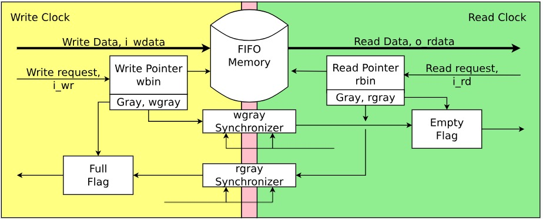

# Synch2AsyncFIFO
### Introduction 

This project highlights the differences between synchronous and asynchronous FIFO designs , providing implementations that focus on their logic and functionality.  

Key aspects covered in this project:  
- **Synchronous FIFO:** Operates under a single clock domain, making it simple and efficient for systems where data transfer occurs at the same clock rate.  
- **Asynchronous FIFO:** Supports communication between different clock domains, solving the challenge of transferring data reliably in heterogeneous systems.  

Additional insights include:  
- Proper handling of metastability issues in asynchronous designs.  
- Explanation of control signals like "write enable," "read enable," and pointers for both designs.  
- Use cases and advantages of each design in hardware systems.  

This project is a great resource for anyone looking to understand and implement FIFO structures in Verilog or similar hardware description languages.

    
    
<i>Figure_1 : Illustration of Enqueue and Dequeue operations in a FIFO.</i>

### Applications of Async FIFOs

Asynchronous FIFOs are commonly used in scenarios where data must be transferred between two parts of a system operating at different clock frequencies. They play a critical role in ensuring reliable data transfer across asynchronous clock domains. Some typical use cases include:

- **Interfacing between different clock domains**: For instance, transferring data from a high-speed processor to a slower peripheral device, or vice versa.
- **Communication between system modules**: In a system-on-chip (SoC), where different modules may operate at independent clock rates, Async FIFOs facilitate seamless data exchange.
- **Data buffering**: They help manage variations in data flow rates, ensuring smooth interaction between producers and consumers in digital systems.
- **Clock domain bridging**: Widely used in FPGA designs and digital circuits, Async FIFOs allow subsystems with differing clock speeds to communicate reliably.

### Architecture and Design Analysis

The block diagram of async. FIFO that is implemented in this repo is given below

 
<i>Figure_2 : Overview of the functional components in an asynchronous FIFO
.</i>

### Read and Write Operations

In an asynchronous FIFO, the read and write operations are managed by separate clock domains. The write pointer always points to the next word to be written. On a FIFO-write operation, the memory location pointed to by the write pointer is written, and then the write pointer is incremented to point to the next location to be written. Similarly, the read pointer always points to the current FIFO word to be read. On reset, both pointers are set to zero. When the first data word is written to the FIFO, the write pointer increments, the empty flag is cleared, and the read pointer, which is still addressing the contents of the first FIFO memory word, immediately drives that first valid word onto the FIFO data output port to be read by the receiver logic. The FIFO is empty when the read and write pointers are both equal, and it is full when the write pointer has wrapped around and caught up to the read pointer.

The conditions for the FIFO to be full or empty are as follows:

**Empty Condition:**
The FIFO is empty when the read and write pointers are equal. This situation occurs during a reset or when the read pointer catches up to the write pointer after reading the last word in the FIFO.

**Full Condition:**
The FIFO is full when the write pointer wraps around and aligns with the read pointer. This indicates that the write pointer has written past the last address in the FIFO and started over at the beginning of the buffer.

To distinguish between the full and empty conditions when the pointers are equal, an extra bit is added to each pointer. This extra bit helps in identifying whether the pointers have wrapped around:

**Wrapping Around Condition:**
When the write pointer surpasses the final address in the FIFO memory, it increments the Most Significant Bit (MSB) while resetting the other bits to zero. A similar behavior applies to the read pointer. If the MSBs of the write and read pointers differ, it indicates that the write pointer has completed one more wrap-around than the read pointer. If their MSBs are identical, both pointers have wrapped around the same number of times. This method ensures precise differentiation between full and empty FIFO states.

**Gray Code Counter:**
Gray code counters are commonly utilized in FIFO designs due to their unique characteristic: only one bit changes at a time during each clock transition. This property minimizes synchronization issues that arise when multiple signals change simultaneously on the same clock edge, ensuring reliable operation in asynchronous systems.

